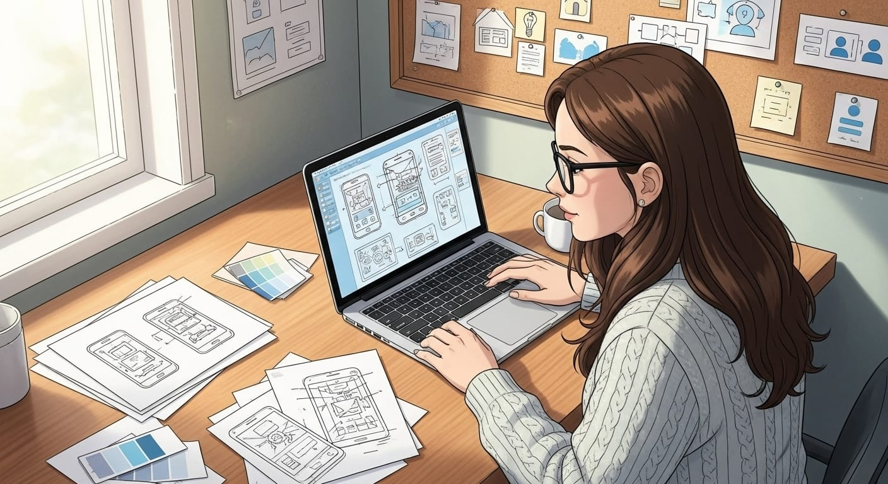

# Hello!
## 🧘🏻‍♀️ I'm Ester Pinheiro
`UX/UI Designer and Product Designer`

 
Driven by curiosity and the belief that the impossible is a matter of opinion, I transitioned my 12+ years of leadership and business vision from the tempered glass industry to the digital universe. My background in Architecture, combined with a specialisation in UX/UI Design and Digital Products, allows me to unite aesthetics and functionality in designing user-centered experiences that deliver real impact. I am now seeking a team where I can apply my creativity, analytical capacity, and global adaptability (honed in Ireland) to exceed user expectations.

💼 What's in my carry-on:
 <ul>
    <li>Tools: Figma</li>
    <li>Artefacts and Deliverables: Low, Medium and High-Fidelity Prototypes, Wireframes, and Interaction Flows</li>
    <li>Processes and Methodologies: User Journey Mapping, Design Systems, Research, and Design Thinking</li>
    <li>Additional Knowledge: Design Sprints and Agile Methodologies</li>
 </ul> 

  📥 Would you like to talk? I enjoy exchanging ideas, exploring possibilities, and considering solutions that go beyond the obvious.

  
  
  

